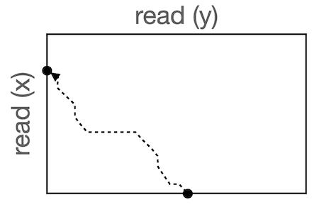

# overlap_alignment
An algorithm for overlap alignment with affine gap penalties

In the fragment assembly task, one needs to determine the extent to which each pair of reads overlaps.  This is made complicated by the fact that reads may have sequencing errors, such as substitutions, insertions, and deletions.  In the presence of sequencing errors, one needs to use a sequence alignment algorithm to determine how reads overlap.
The purpose of this program is to implement this algorithm in the function `overlap_align`.

### The overlap alignment task

In the overlap alignment task we are given two sequences, x and y, and determine the highest scoring alignment of a *suffix* of x with a *prefix* of y.  For example, with the following two sequences:

    x: ATGTAGC
    y: TGCTTA
    
the highest scoring alignment could be:

    x: ATGTAGC   
    y:    T-GCTTA

Note that when we specify an overlap alignment, the prefix of x that is not aligned and the suffix of y that is not aligned is matched against whitespace (' ') characters.

Of course, which alignment scores highest depends on the scoring scheme.  In this problem, we will use a substitution matrix that specifies the score of aligning any pair of characters to each other and an affine gap penalty.  The affine gap penalty will be composed of a gap existence score, $g$, and penalties for each space '-' in the gap that depend on the character to which the space is aligned (this allows for biases in which characters tend to be inserted or deleted).  That is, instead of having a single space penalty, $s$, we will have a character-specific space penalty $S(c, -) = S(-, c)$ that is specified as part of the substitution matrix.

### The affine gap penalty algorithm  
The dynamic programming algorithm for this task is very similar to that of global alignment with affine gap penalties.  
#### main recurrences ($i > 0$ and $j > 0$)

$M(i, j) = \max\left\{
\begin{array}{l}
M(i - 1, j - 1) + S(x_i, y_j) \\
I_x(i - 1, j - 1) + S(x_i, y_j) \\
I_y(i - 1, j - 1) + S(x_i, y_j)
\end{array}
\right.$

$I_x(i, j) = \max\left\{
\begin{array}{l}
M(i - 1, j) + g + S(x_i, -) \\
I_x(i - 1, j) + S(x_i, -) \\
\end{array}
\right.$

$I_y(i, j) = \max\left\{
\begin{array}{l}
M(i, j - 1) + g + S(y_j, -) \\
I_y(i, j - 1) + S(y_j, -) \\
\end{array}
\right.$

#### initialization

$M(0, 0) = 0$

$I_x(0, 0) = 0$

$I_y(0, 0) = g$

$\forall i > 0, I_x(i, 0) = 0$

$\forall j > 0, I_y(0, j) = I_y(0, j-1) + S(y_j, -)$

All other entries in the first row and first column should be set to $-\infty$.

The main difference from standard global alignment is that the first column for $I_x$ is set to all zeros, which allows for an alignment of any suffix of $x$ without penalty for the corresponding prefix of $x$ that is not aligned.

#### traceback
The traceback procedure for overlap alignment is slightly different from that of global alignment.  Traceback starts at the cell with the maximum value in the *last row* (instead of the lower right corner) and stops when a cell is reached in the *first column* (the convention used here is that $x$ indexes the rows and $y$ indexes the columns).  Such a traceback path corresponds to an alignment of a suffix of $x$ and a prefix of $y$.  Below is a sketch of what a traceback looks like for this task.

### The main function, overlap_algin
The function implements the algorithm as described above and takes as input two sequences, `x` and `y`, a substitution matrix (which also encodes character-specific space scores), and a gap score ($g$).  The substitution matrix will be represented as a dictionary with two-element tuples, `(a, b)`, as keys and scores as values.  
The function returns a tuple of two elements, the first being the score of an optimal alignment, and the second being a single alignment that obtains that score. 
The final alignment will be represented as a list of two strings.  

This implementation uses an efficient (polynomial-time) dynamic programming algorithm.

#### tiebreaking
In the case that there are multiple optimal alignments, during the traceback, if there are ties for which matrix to jump back to at each step, the order of preference for which matrix to jump to will be ($I_x$, $M$, $I_y$).  For example, in a $M$ cell, if the $M$ and $I_x$ cases in the recurrence both tie for the maximum, then during the traceback, We would prefer to jump back to the $I_x$ cell.  In addition, if there are ties for maximum value in the last row in different columns, We will start the traceback at the column with the largest index $j$.
